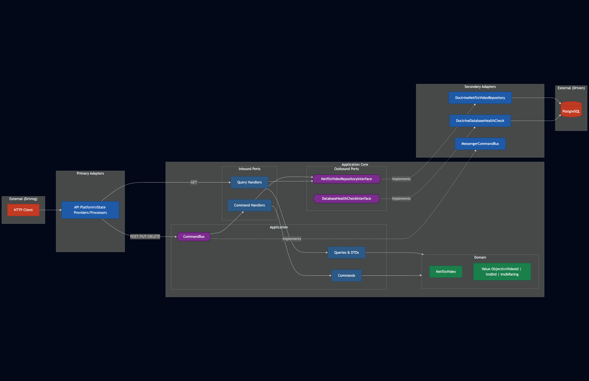

# Symfony API Platform Application

A simple PHP API application using Symfony 7.4 and API Platform 4.0 providing health check and a basic Resource.

## Architecture

This project follows **Hexagonal Architecture** (Ports & Adapters) with **Domain-Driven Design** principles.



### Layer Dependencies

```
┌─────────────────────────────────────────────────────────────┐
│                     Infrastructure                          │
│  (API Platform, Doctrine, Messenger, External Services)     │
├─────────────────────────────────────────────────────────────┤
│                      Application                            │
│  (Commands, Queries, Handlers, DTOs, CommandBus Interface)  │
├─────────────────────────────────────────────────────────────┤
│                        Domain                               │
│  (Entities, Value Objects, Repository Interfaces)           │
└─────────────────────────────────────────────────────────────┘
         ↑ Dependencies flow inward (toward Domain)
```

### Key Principles

- **Domain Layer**: Pure business logic, no framework dependencies
- **Application Layer**: Use case orchestration, framework-agnostic
- **Infrastructure Layer**: Technical implementations (Doctrine, Symfony, API Platform)

Architecture rules are enforced by **Deptrac** on every commit.

See [ADR-001](docs/adr/001-hexagonal-architecture-with-ddd.md) for detailed documentation.

## Requirements

- Docker
- Docker Compose

No local PHP installation is required!

## Getting Started

### Quick Setup (Recommended)

For first-time setup or clean installation, run:

```bash
make setup
```

This will:
- Clean up existing containers and volumes
- Build and start Docker containers
- Wait for PostgreSQL to be ready
- Install Composer dependencies
- Create databases (dev and test)
- Run all migrations
- Clear caches
- Run tests to verify everything works
- Run PHPStan and Deptrac validation

**Setup time**: ~2-3 minutes

To see all available commands:
```bash
make help
```

### Common Tasks

```bash
# Development
make up              # Start containers
make down            # Stop containers
make restart         # Restart containers
make logs            # View container logs
make shell           # Open PHP container shell

# Database
make db-create       # Create database
make db-migrate      # Run migrations
make db-reset        # Drop and recreate database

# Testing & Quality
make test            # Run PHPUnit tests
make phpstan         # Run static analysis
make deptrac         # Validate architecture
make qa              # Run all quality checks

# Cache
make cache-clear     # Clear Symfony cache

# Status
make status          # Show container status
```

### Access the Application

- **API Platform Interactive Docs (Swagger UI)**: http://localhost:8001/api
- **OpenAPI Specification (JSON)**: http://localhost:8001/api/docs.json
- **Health Check Endpoint**: http://localhost:8001/api/health
- **Netflix Videos API**: http://localhost:8001/api/netflix_videos

## Helper Scripts (Alternative)

If you prefer not to use Make, helper scripts are still available:

```bash
./php [command]          # Run any command in PHP container
./composer [command]     # Run Composer commands
./console [command]      # Run Symfony console commands
./test                   # Run PHPUnit tests
./phpstan analyse        # Run static analysis
./deptrac analyze        # Validate architecture
```

## Technology Stack

- **PHP**: 8.5
- **Symfony**: 7.4 (LTS)
- **API Platform**: 4.0
- **Doctrine ORM**: 3.3+
- **Doctrine Bundle**: 3.0+
- **PHPUnit**: 12.0+
- **PHPStan**: 2.1+ (Level 9 - maximum strictness)
- **Deptrac**: Architecture validation
- **PostgreSQL**: 15
- **Docker**: For containerization

## Development

All code in the current directory is mounted into the container, so changes are reflected immediately without rebuilding.

### Git Hooks (Automatic Quality Checks)

Git hooks are **automatically installed** when you run:
- `make setup` or `make install`
- `composer install` or `composer update`

**Pre-commit hook** runs before each commit:
- ✅ PHPStan (Level 9) - Static analysis
- ✅ Deptrac - Architecture validation

This ensures all commits maintain code quality and architectural boundaries.

**Manual installation**:
```bash
make hooks
```

**Bypass hook** (not recommended):
```bash
git commit --no-verify
```

## Troubleshooting

### Container won't start
```bash
make clean
make up
```

### Permission issues
```bash
docker-compose exec php chown -R www-data:www-data /var/www/html
```

### Database issues
```bash
make db-reset
```

### Reset entire environment
```bash
make setup
```
This will clean up and rebuild everything from scratch.

### View logs
```bash
make logs
```


